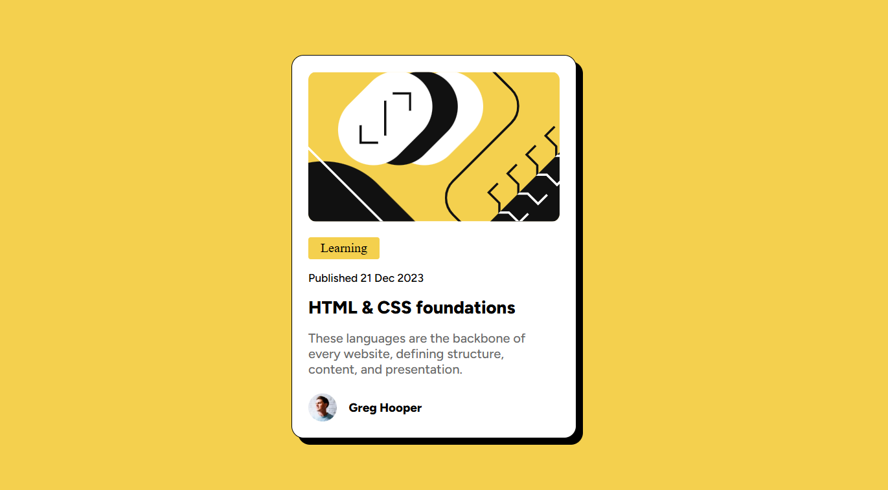

# Frontend Mentor - Blog preview card solution
This is a solution to the [Blog preview card challenge on Frontend Mentor](https://www.frontendmentor.io/challenges/blog-preview-card-ckPaj01IcS). Frontend Mentor challenges help you improve your coding skills by building realistic projects. 

## Table of contents
- [Overview](#overview)
  - [Screenshot](#screenshot)
  - [Links](#links)
- [My process](#my-process)
  - [Built with](#built-with)
  - [What I learned](#what-i-learned)

## Overview
This project is a solution to the Blog Preview Card challenge from Frontend Mentor. The goal was to build a visually accurate and responsive card component using HTML and CSS, while improving layout, styling, and design skills.
### Screenshot

### Links
Live site - https://soumiligiri.github.io/Blog-Preview-Card/

## My process
### Built with
HTML
CSS

### What I learned
Through this project, I reinforced my knowledge of semantic HTML and modern CSS practices. I improved my ability to structure clean layouts, manage spacing and alignment, and visually appealing UI components.
